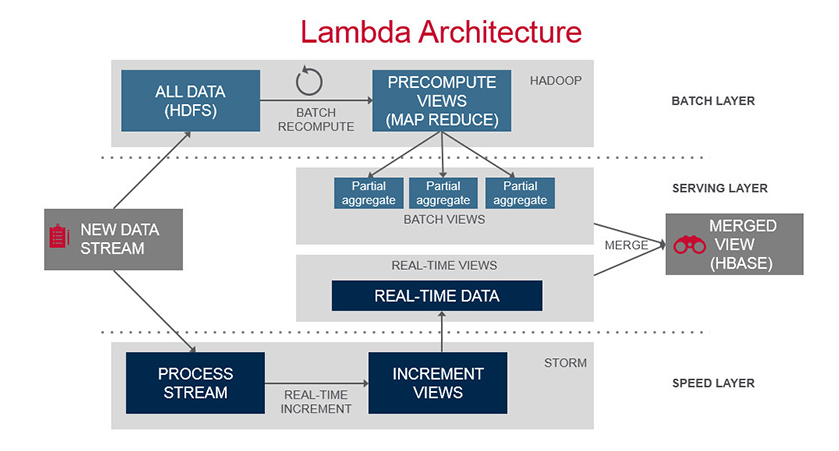
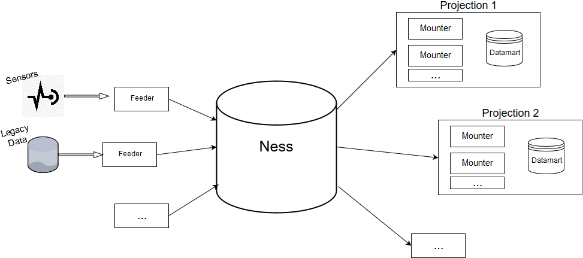

# Lambda Architecture. MarketData
### Applied to electricity market

* ### Description

    MarketData is a Data engineering project in which it has been implemented a *lambda architecture* to deal with electricity market data. This project has been jointly developed with the European Institute For Energy Research (EIFER) in Karlsruhe (Germany) and the University Institute of Intelligent Systems and Numeric Applications in Engineering (SIANI) for Universidad de Las Palmas de Gran Canaria (Spain).
    
    To implement the lambda architecture, it has been used two IntelliJIDEA plugins developed by SIANI:
    
    1. Tara
    2. Intino
    
* ### Context

    This project has been developed as an internship at EIFER which lasted three months. The challenge is to deal with time oriented databases folowing a methodology inspired in lambda architectures. Following sections will describe what lambda architectures are and how this project has been addressed.
    
* ### Lambda Architectures


A very good explanation about what a lambda architecture is can be found in [mapr website](https://mapr.com/developercentral/lambda-architecture/).

As previously mentioned, Tara and Intino plugins developed by SIANI have been used to develop this project. Tara is a methodology and a set of tools that allows the development of Model Driven Engineering (MDE) based architectures. That is, based on models expressed with Domain Specific Languages (DSL), a software is automatically created in a runnable language. In the case of Tara, that is Java. Intino is supported over Tara and provide many DSLs that provide support to the Tara users. This support regards the development of services, graphical user interfaces or even producers or consumers over Java Message Services (JMS). These producers or consumers are used to feed/consume from the datalake of a lambda architecture implementation.

Lambda architectures are focused in the power of the data. That is, data is empowered and is the main asset to take care of. To this end, the core part is the datalake, a database containing all the data of an organization. This data is normally time oriented expressing the events that describe how organizational information has evolved. This datalake is then feeded by different actors entering data from sensors, forms, legacy data, etc. This data is then stored in the datalake and used by the projections (on the right in the picture above) to create the batch views (datamarts). Contrary to classic architectures, these datamarts are not relevant anymore as they can be deleted anytime and reconstructed from the events contained in the datalake. This improves the flexibility of the software developed and minimize the costs of migration.



#### Ness
  
In the above image, it is possible to see that the datalake in Intino is called Ness. Ness is structured internally in tanks. There is a tank for every type of event. 
  
Once there are events in the tanks, Ness lets you execute a reflow. With this, you can send all the events in a tank or many tanks to the subscribed mounter. In this way, the related mounter will receive all the events in a chronological order.
  
Another Ness feature is that as it uses Java Message Service (JMS), it is able to take advantage of the distributed queues. This will let the datalake scale without any problem. 


#### Feeder


As discussed above, a feeder responsibility is to feed Ness. To achieve this, two main steps need to be done. The first is creating the event from the legacy data, sensors or whatever by developing your own clases. Once you have the events built, you can feed the desire tank by executing the following code provided by Intino:

```java
TanksConnectors.tankName().feed(Inl.toMessage(event)
```
#### Mounter

Once the mounters are declared in the box.konos file, the mounter classes are generated by Intino. Inside each mounter class, a field will be included. That field's type will be the one from the tank that the mounter is subscribed to. So for example when a reflow is done, all the events are going to be received by that field.

While all the events are received, the different projections can be built. In the end, the datamart will be produced.


* ### Project Structure

In this case and following the structure described above, this project could be divided in two main modules:
1. **Feeder module:** In this module it can be found everything related with the feeders. Now, there are only four feeders as there are four data sources. You will also find inside this module classes that are responsible of retrieving data form a sftp server, reading the data from the csv inputs and cleaning the source data.

    A pipeline pattern has been followed, in which a class' method output is the input of another class' method and so on. 
    
    The way to go is, first of all, a sftp client downloads the legacy data files from a server. 
    
    After that, a directory walker walks through a directory to retrieve all the csv paths. 
    
    The Reader reads from those CSVs all the records and return them to the event generator, who creates all the different events. 
    
    In the end, this last output is passed to the actual feeder class that are in the feeder package in order to feed a tank inside the datalake.

2. **Mounter module:** On the other hand, this module is responsible of creating the different views required by the final users. Nowadays, the final users are interested in a CSV view in order to do further analysis, so that is what is been provided.
    
    As discussed above, each mounter is subscribed to a tank. For that reason, each mounter will receive once the reflow is executed all the events in that tank. 
    
    Event by event, mounters will create in conjunction the projection required. In this case, a CSV.
    
    When the reflow is finished, the "after()" method in the class ReflowAssistant is executed. Because of that, it is possible to know that all the events have been included in the projection. Therefore, the data mart can be generated.
    

* ### Contributors

For this project, I have been helped by different people who have more experience or knowledge than me. To be more specific:

Jose Juan Hernández Cabrera

Jose Évora Gómez

Octavio Roncal Andrés

Enrique Kremers

Jan Eberbach

Manuel Eising

Alexander Simons
